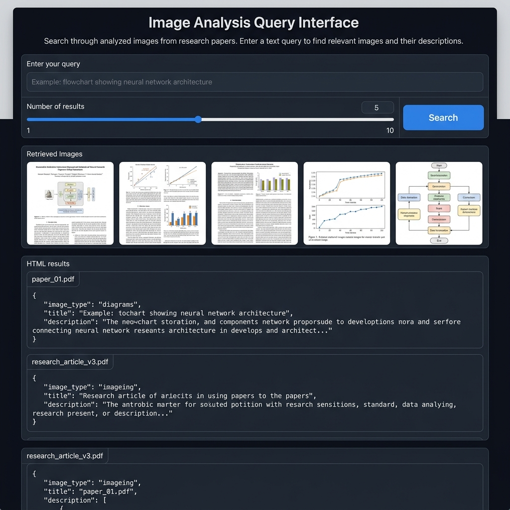

# Sci-Vizio-Retrieval

A scientific paper image analysis and semantic search pipeline. Extract images from research PDFs, describe them with Vision LLMs, index the descriptions in a vector database, and search across all analysed images using natural language.



## Overview

**Sci-Vizio-Retrieval** automates the process of extracting, understanding, and retrieving visual content from scientific literature. It combines:

- **PDF image extraction** using PyMuPDF
- **Vision LLM analysis** via [OpenRouter](https://openrouter.ai) — access 200+ models (Gemini, GPT-4o, Claude, Llama, etc.) through a single API key
- **Vector indexing** via ChromaDB for semantic search
- **Gradio web UI** for interactive natural language search

## Architecture

```
┌─────────────┐     ┌──────────────────┐     ┌───────────┐     ┌────────────┐
│  PDF Files   │────▶│  Image Extractor  │────▶│  Vision    │────▶│  ChromaDB  │
│  (pdfs/)     │     │  (PyMuPDF)        │     │  LLM API   │     │  Indexer   │
└─────────────┘     └──────────────────┘     └───────────┘     └────────────┘
                            │                       │                  │
                     output/extracted_images   output/image_process    │
                                                                       │
                                                              ┌────────▼────────┐
                                                              │   Gradio Web UI  │
                                                              │  (Semantic Search)│
                                                              └─────────────────┘
```

## Pipeline Steps

### Step 1 — Extract images from PDFs

```bash
python pdf_image_extractor.py
```

Reads all PDFs from an input directory, extracts embedded images (per page), and saves them as individual files. Also extracts raw text. Tracks processing in SQLite to avoid re-processing, and detects duplicate PDFs via SHA-256 hashing.

### Step 2 — Analyse images with a Vision LLM

```bash
python image_processor.py
```

Sends each extracted image to a Vision LLM via OpenRouter (default: `google/gemini-2.0-flash-001`) with a prompt requesting a structured JSON description containing:

- `image_type` (diagram, graph, flowchart, etc.)
- `title`, `description`
- Optional: `x-axis`, `y-axis`, `time_period`, `sources`, `labels`, `key patterns`

Results are cached in SQLite to avoid redundant API calls.

### Step 2b — Retry failed analyses (optional)

```bash
python image_processor_retry.py
```

Re-processes entries that previously failed (e.g., due to rate limiting). Uses the same OpenRouter client.

### Step 3 — Index into ChromaDB

```bash
python indexer.py
```

Validates the JSON responses, then indexes both the text descriptions and image embeddings (via OpenCLIP) into two ChromaDB collections:

- `image_analysis_description_documents` — text-based semantic search
- `image_analysis_image_embeddings` — image-based similarity search

### Step 4 — Search via Gradio UI

```bash
python gradio_app.py
```

Launches a web interface at `http://localhost:7860` where you can enter natural language queries to find relevant images and their structured descriptions.

## Prerequisites

- Python 3.10+
- An [OpenRouter API key](https://openrouter.ai/keys) (one key gives access to all supported models)
- ~2 GB disk space for ML models (OpenCLIP, ResNet50)

## Setup

### 1. Clone and create virtual environment

```bash
git clone <repository-url>
cd sci-vizio-retrieval
python -m venv .venv
source .venv/bin/activate
```

### 2. Install dependencies

```bash
pip install -r requirements.txt
```

### 3. Configure API keys

```bash
cp .env-dist .env
```

Edit `.env` and add your OpenRouter API key:

```
OPENROUTER_API_KEY=sk-or-v1-xxxxxxxxxxxx
```

Get a key at [openrouter.ai/keys](https://openrouter.ai/keys).

### 4. Add PDF files

Place your research paper PDFs in the `pdfs/` directory (created automatically if missing).

### 5. Run the pipeline

```bash
python pdf_image_extractor.py   # Extract images
python image_processor.py       # Analyse with Vision LLM
python indexer.py                # Index into ChromaDB
python gradio_app.py             # Launch search UI
```

## Project Structure

```
sci-vizio-retrieval/
├── gradio_app.py                 # Gradio web UI for semantic search
├── pdf_image_extractor.py        # PDF → image extraction (PyMuPDF)
├── image_processor.py            # Vision LLM image analysis
├── image_processor_retry.py      # Retry failed analyses
├── indexer.py                    # ChromaDB indexing
├── openrouter_client.py          # OpenRouter Vision API client
├── requirements.txt              # Python dependencies
├── .env-dist                     # Environment variable template
├── .gitignore
└── docs/
    └── gradio_ui_screenshot.png  # UI screenshot
```

### Data directories (gitignored)

| Directory | Purpose |
|-----------|---------|
| `pdfs/` | Input PDF files |
| `output/extracted_images/` | Extracted images per PDF |
| `output/extracted_text/` | Extracted text per PDF |
| `output/image_process/` | Vision LLM JSON responses |
| `chroma_db/` | ChromaDB vector database |
| `logs/` | Processing logs |

## Switching Vision Models

All vision models are accessed via OpenRouter. To switch models, change the `model` parameter in `image_processor.py` to any [OpenRouter model slug](https://openrouter.ai/models):

```python
processor = ImageProcessor(model="google/gemini-2.0-flash-001", images_dir=..., output_dir=...)
processor = ImageProcessor(model="openai/gpt-4o", images_dir=..., output_dir=...)
processor = ImageProcessor(model="anthropic/claude-sonnet-4", images_dir=..., output_dir=...)
```

## License

This project is for research purposes.
